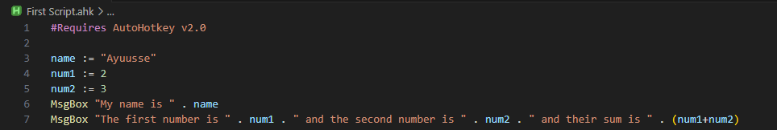

# Basic Syntax
**The following things will be used alot, and is very useful and important to know about when writing a AutoHotkey Script.**

---
## Quick Reference
* [MsgBox](#1.-MsgBox-link)
* [Hotkeys](#2.-Hotkeys-link)
* [Sleep](#3.-Sleep-link)
* [Send](#4.-Send-link)
* [Functions/Methods](#5.-Functions/Methods-link)
* [Variables](#6.-Variables-link)
* [MouseGetPos](#7.-MouseGetPos-link)
* [MouseMove](#8.-MouseMove-link)
* [Click](#9.-Click-link)
* [ToolTip](#10.-ToolTip-link)
* [Loop](#11.-Loop-link)
* [While loop](#12.-While-loop-link)

----

## **1. MsgBox** [[Link]](https://www.autohotkey.com/docs/v2/lib/MsgBox.htm):
Like the name suggests its a handy little thing to display a Message on your screen. When used it will pop up with a window containing your Message.


## **2. Hotkeys** [[Link]](https://www.autohotkey.com/docs/v2/Hotkeys.htm):
Its best to show how this works using an example.

1. Open your `.ahk` file you created and write the following things
        
    
        
2. Run the Script.
3. Now when ever you press `q` on your keyboard a **MsgBox** will apper saying "Hello World!"

     * **You can also combine keys**

        

        After running the script, if you press `q` and `w` at the same time a MsgBox will appear with the message **"You just presses q and w at the same time"** and when you press `shift` and `q` a MsgBox with **"You just presses shift and q at the same time"** will appear. 
         
    So Hotkeys are just keys or a combination of keys which execute a function or a block of statements when pressed.

    * **Table of hotkeys**

        | Symbol    | Key   |
        | -------   | ----  | 
        |#          |     `Win`(Windows logo key)  |
        |!           |     `Alt`  | 
        |+           |      `Shift` | 
        |^           |     `Ctrl`  |

    For more on Hotkeys it is recomended to see the the documentation  [[Link]](https://www.autohotkey.com/docs/v2/Hotkeys.htm).
    
## **3. Sleep** [[Link]](https://www.autohotkey.com/docs/v2/lib/Sleep.htm):
As the name suggests it will make the script wait the amount of specified:


## **4. Send** [[Link]](https://www.autohotkey.com/docs/v2/howto/SendKeys.htm):
Now the most important thing that you will be using the most.
**Send** sends simulated keystrokes and mouse clicks to the active window.


1. Pressing `q` will press enter once.
2. Pressing `w` will press enter 5 times.
3. Pressing `e` will make it so that the shift key is pressed down.
4. Pressing `Shift` and `a` at the same time will make it so that the shift key is released.
5. Pressing `s` will press the k key for 1 sec then release it.

    This is a table of Key names [[Link]](https://www.autohotkey.com/docs/v2/lib/Send.htm#keynames).

## **5. Functions/Methods** [[Link]](https://www.autohotkey.com/docs/v2/Variables.htm): 
Both function and method means the same thing,it is a reusable block of code that can be executed by calling it.


 Now pressing `q` or `w` will call the same method.

 * Parameters [[Link]](https://www.autohotkey.com/docs/v2/Functions.htm#param): when calling a function you can add certain Parameters to it.

    
    
    Now pressing `q` will show a MsgBox with message **"The sum of the two numbers is 5"**  and pressing `w` will show a MsgBox with message **"The sum of the two numbers is 40"**


## **6. Variables** [[Link]](https://www.autohotkey.com/docs/v2/Variables.htm): 
In simple terms it's a plce to hold some value.
``` Python
StringVariable := "A variable to Store a String"
NumberValue := 123
Copy_of_NumberValue := NumberValue
```


Running the script shows a MsgBox with message **"My name is Ayuusse"** and after closing it the second MsgBox will contain the message **"The first number is 2 and the second number is 3 and their sum is 5"**.

* Local Variables [[Link]](https://www.autohotkey.com/docs/v2/Functions.htm#Local): These are varibles that are only accessable/visible in the function they are defined in.

    

    The above Script will show an error **"Warning: This local variable appears to never be assigned a value."** As the variable `x` is only accessable in the method of **q** but not in the method of **w**.

* Global Variables [[Link]](https://www.autohotkey.com/docs/v2/Functions.htm#Global): There are Global Variables, which you can read about from the link.

## **7. MouseGetPos** [[Link]](https://www.autohotkey.com/docs/v2/lib/MouseGetPos.htm): 
It is used to find the current position of your mouse in your active screen.


Now whenever you press `q` a MsgBox will appear with the current position of your mouse.

## **8. MouseMove** [[Link]](https://www.autohotkey.com/docs/v2/lib/MouseMove.htm): 
It moves your mouse to the specified coordinates of your active screen.


Now whenever you press `q` your Mouse will move to the specified coordinates, here it is `300,300`.

## **9. Click** [[Link]](https://www.autohotkey.com/docs/v2/lib/Click.htm):
It is used to click your mouse at the specified coordinates.


Now whenever you press `q` your Mouse will move to `300,300` and then **Left Click**, and when you press `w` your Mouse will move to `500,500` and **Right Click**.

## **10. ToolTip** [[Link]](https://www.autohotkey.com/docs/v2/lib/ToolTip.htm): 
Like MsgBox it is used show some message. But unlike MsgBox it does not pause the running of your script. You can remove any ToolTip by just running `ToolTip`.
    


When you press `q` will show the message every second, and pressing `w` will remove any ToolTip.  

## **11. Loop** [[Link]](https://www.autohotkey.com/docs/v2/lib/Loop.htm): 
It performs a set of statements for a specified number of times or untill `Break` is performed.


Pressing `q` will show ToolTip from 1-10 every 0.5 sec, while pressing `w` will also will show ToolTip from 1-10 every 0.5 sec but at the 5th loop it will break because of the if statement, ie it will exit the loop. 

## **12. While loop** [[Link]](https://www.autohotkey.com/docs/v2/lib/While.htm): 
It performs a set of statements until the given expression is evaluated to be false or until `Break` is performed.


