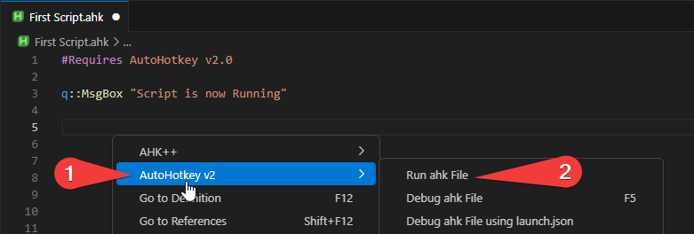

# Basics
## Quick Reference

* [Making a file](#Making-a-file) 

* [Running the file](#Running-the-file)

* [Stopping the Script](#Stopping-the-Script)

## Making a file
1. Start by creating a folder where you would like to store these Files. 
2. Open the folder using VS code.

   

3. Create a new File but **MAKE SURE IT ENDS WITH ``.ahk``**

    

4. Great you just created your first AutoHotkey file.
---
## Running the file

If you want to run your AutoHotkey file then just **Right Click**, then click **AutoHotkey v2**, then **Run ahk file**.  

Now if you look at the hidden icons at the bottom of your screen you will see that a AutoHotkey icon. This means that your AutoHotkey file is running.

---

## Stopping the Script

If you want to stop your AutoHotkey Script then just **Right Click** on the icon at the bottom right, then **Right Click**, then click **Exit**.  

---

 