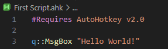
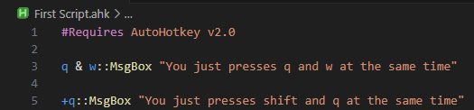
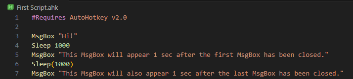
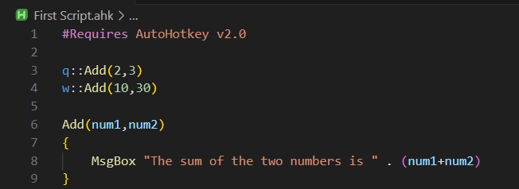
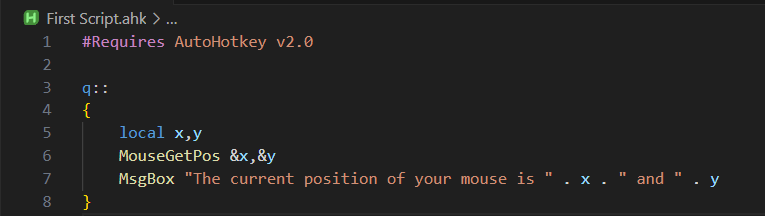

# Game automation using AutoHotkey
*A guide to help you make games play by themself.*

# Welcome
AutoHotkey is scripting language to help you automate mundane tasks on your pc. It’s easy to learn but can be very powerful. This course will walk you through from basics like single key automation to advanced code writing to make it so that you don’t have to play all day just to level up once.

* **What you'll learn:** Use AutoHotkey to make games play by themselves.
* **How long:** You can read all of this in under 15 min, and I can guarantee that you will not be disappointed.
 
# Quick Reference
* [Disclaimer](#Disclaimer) 
* [Prerequisites](#Prerequisites) 
* [Basics](#Basics) 
* [Important Things to Know](#Important_Things_to_Know)

# Disclaimer
> _Disclaimer_

# Prerequisites
### **Must Have**
* **AutoHotkey[[Link]](https://www.autohotkey.com/v2/):** Its kind of obvious but you will need AutoHotkey for this, we will be using AutoHotkey v2 as there is no point in learning v1. Follow the Installation instructions its not very complicatied. 

* **VS code[[Link]](https://code.visualstudio.com/download):** Since we are writing a programme its recommended to use some kind of IDE, I personally use VS code with the following extensions.

    | Extensions    | Link   |
    | ----------    | ----   |
    | AHK++ (AutoHotkey Plus Plus)    | [link](https://marketplace.visualstudio.com/items?itemName=mark-wiemer.vscode-autohotkey-plus-plus)   |
    | AutoHotkey v2 Language Support    | [link](https://marketplace.visualstudio.com/items?itemName=thqby.vscode-autohotkey2-lsp)   |

### **Optional (but recomended)**

* **Roblox:** I know it’s kind of odd but it’s a convenient way for me to share a place where you can test out **your** code.
* **Prior Programming Knowledge:** If you know even a little about programming this course will be much easier for you to digest but if you don't, worry not as this course is very easy.  

---

# Basics
## Making the file
1. Start by creating a folder where you would like to store these Files.<br>
2. Open the folder using VS code.

   

3. Create a new File but **MAKE SURE IT ENDS WITH ``.ahk ``**

    

4. Great you just created your first AutoHotkey file.


## Running the file

If you want to run your AutoHotkey file then just **Right Click**, then click **AutoHotkey v2**, then **Run ahk file**.  


 Now if you look at the hidden icons at the bottom of your screen you will see that a AutoHotkey icon. This means that your AutoHotkey file is running.
 ## Stopping the Script

If you want to stop your AutoHotkey Script then just **Right Click** on the icon at the bottom right, then **Right Click**, then click **Exit**.  

---

 # Important Things to Know

**The following things will be used alot, and is very useful and important to know about when writing a AutoHotkey Script.**

* MsgBox [[Link]](https://www.autohotkey.com/docs/v2/lib/MsgBox.htm):
Like the name suggests its a handy little thing to display a Message on your screen. When used it will pop up with a window containing your Message.

    

* Hotkeys [[Link]](https://www.autohotkey.com/docs/v2/Hotkeys.htm):
Its best to show how this works using an example.

    1. Open your `.ahk` file you created and write the following things
        
        
        
    2. Run the Script.
    3. Now when ever you press `q` on your keyboard a **MsgBox** will apper saying "Hello World!"

    * **You can also combine keys**

        

        After running the script, if you press `q` and `w` at the same time a MsgBox will appear with the message **"You just presses q and w at the same time"** and when you press `shift` and `q` a MsgBox with **"You just presses shift and q at the same time"** will appear. 
         
    So Hotkeys are just keys or a combination of keys which execute a function or a block of statements when pressed.

    * **Table of hotkeys**

        | Symbol    | Key   |
        | -------   | ----  | 
        |#          |     `Win`(Windows logo key)  |
        |!           |     `Alt`  | 
        |+           |      `Shift` | 
        |^           |     `Ctrl`  |

    For more on Hotkeys it is recomended to see the the documentation  [[Link]](https://www.autohotkey.com/docs/v2/Hotkeys.htm).
    
* Sleep [[Link]](https://www.autohotkey.com/docs/v2/lib/Sleep.htm):
As the name suggests it will make the script wait the amount of specified:

    

* Send [[Link]](https://www.autohotkey.com/docs/v2/howto/SendKeys.htm):
Now the most important thing that you will be using the most.
**Send** sends simulated keystrokes and mouse clicks to the active window.

    

    1. Pressing `q` will press enter once.
    2. Pressing `w` will press enter 5 times.
    3. Pressing `e` will make it so that the shift key is pressed down.
    4. Pressing `Shift` and `a` at the same time will make it so that the shift key is released.
    5. Pressing `s` will press the k key for 1 sec then release it.

    This is a table of Key names [[Link]](https://www.autohotkey.com/docs/v2/lib/Send.htm#keynames).
* Functions/Methods [[Link]](https://www.autohotkey.com/docs/v2/Variables.htm): Both function and method means the same thing,it is a reusable block of code that can be executed by calling it.

    

    Now pressing `q` or `w` will call the same method.

    * Parameters [[Link]](https://www.autohotkey.com/docs/v2/Functions.htm#param): when calling a function you can add certain Parameters to it.

        
    
        Now pressing `q` will show a MsgBox with message **"The sum of the two numbers is 5"**  and pressing `w` will show a MsgBox with message **"The sum of the two numbers is 40"**


* Variables [[Link]](https://www.autohotkey.com/docs/v2/Variables.htm): In simple terms it's a plce to hold some value.
    ``` Python
    StringVariable := "A variable to Store a String"
    NumberValue := 123
    Copy_of_NumberValue := NumberValue
    ```
     

    Running the script shows a MsgBox with message **"My name is Ayuusse"** and after closing it the second MsgBox will contain the message **"The first number is 2 and the second number is 3 and their sum is 5"**.

    * Local Variables [[Link]](https://www.autohotkey.com/docs/v2/Functions.htm#Local): These are varibles that are only accessable/visible in the function they are defined in.

         

        The above Script will show an error **"Warning: This local variable appears to never be assigned a value."**
        As the variable `x` is only accessable in the method of **q** but not in the method of **w**.

     * Global Variables [[Link]](https://www.autohotkey.com/docs/v2/Functions.htm#Global): There are Global Variables, which you can read about from the link.

* MouseGetPos [[Link]](https://www.autohotkey.com/docs/v2/lib/MouseGetPos.htm): It is used to find the current position of your mouse in your active screen.

    

    Now whenever you press `q` a MsgBox will appear with the current position of your mouse.

* MouseMove [[Link]](https://www.autohotkey.com/docs/v2/lib/MouseMove.htm): It moves your mouse to the specified coordinates of your active screen.

    

    Now whenever you press `q` your Mouse will move to the specified coordinates, here it is `300,300`.

* Click [[Link]](https://www.autohotkey.com/docs/v2/lib/Click.htm): It is used to click your mouse at the specified coordinates.

    

    Now whenever you press `q` your Mouse will move to `300,300` and then **Left Click**, and when you press `w` your Mouse will move to `500,500` and **Right Click**.